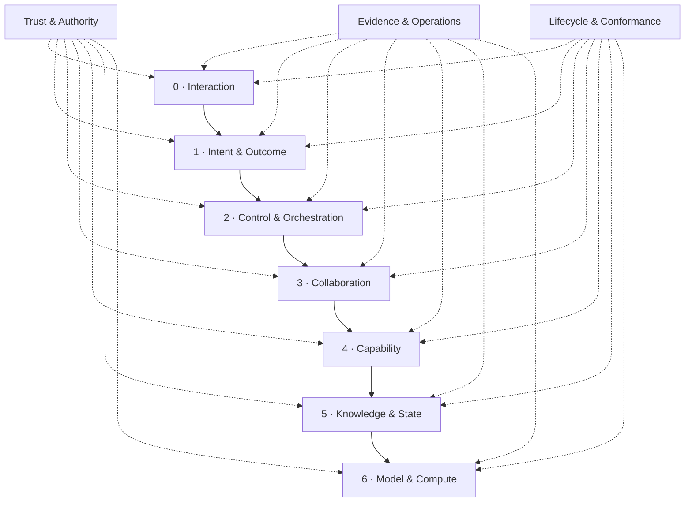

# AgenticStrata

AgenticStrata is an executable reference architecture for enterprise agentic applications. It defines application-level runtime contracts, tamper-evident receipts, and conformance profiles without prescribing a model, agent framework, cloud, database, or deployment topology.

The architecture is intentionally more than a layer diagram. A run can be validated, replayed, explained to a non-specialist, and checked against evidence produced by the actual capability lifecycle.

## The seven strata



Logical strata may share one process. The rule is a dependency and responsibility boundary, not seven required services.

| Stratum | Owns | Must not own |
| --- | --- | --- |
| Interaction | Human, API, and event boundary | Authority issuance or model selection policy |
| Intent & Outcome | Canonical intent, constraints, acceptance criteria, safe cache fingerprint | Side effects |
| Control & Orchestration | Plans, budgets, routing, approvals, lifecycle state | Provider-specific business logic |
| Collaboration | Delegation, handoff, coordination | Authority expansion |
| Capability | Typed prepare/commit/verify/compensate operations | Hidden credentials or unbounded tools |
| Knowledge & State | Authoritative state, retrieval, artifacts, provenance | Treating retrieved text as authority |
| Model & Compute | Replaceable inference and compute providers | Authorization decisions |

## What is executable

- A JSON Schema 2020-12 contract bundle for manifests, intent, criterion results, execution, runtime boundaries, authority, delegation, capabilities, evidence, receipts, and conformance reports.
- A composite cache fingerprint that requires both semantic and operational equivalence: policy, capability set, authoritative context, tenant, privacy, constraints, and outcome are all bound.
- An RFC 8785 JSON Canonicalization Scheme implementation with cross-language golden vectors, strict duplicate-member rejection at the JSON boundary, and a hash-linked receipt chain with tamper and missing-evidence detection.
- Runtime conformance checks for rooted authority, causal evidence, actual budget consumption, exact-action idempotency, approval, read-back or compensation, predeclared criterion evidence bindings, layer direction, and model/authority separation.
- Mapping-only adapter documents for AG-UI, A2A, MCP, OpenTelemetry GenAI, CloudEvents, and an external policy engine.
- A neutral prepare/commit/read-back demo with exact-action approval and duplicate suppression.

## Quick start

Requires Node.js 22 or newer.

```bash
npm ci
npm run check
npm run demo
```

The demo writes a `RunBundle`, `ConformanceReport`, and plain-language explanation under `.tmp/demo`.

```bash
node dist/cli.js validate examples/application.manifest.yaml
node dist/cli.js lint examples/application.manifest.yaml
node dist/cli.js conformance examples/generic-change/run.bundle.json --profile enterprise
node dist/cli.js replay examples/generic-change/run.bundle.json
node dist/cli.js explain examples/generic-change/run.bundle.json --profile enterprise
```

All commands accept JSON; `validate` and `lint` also accept YAML. Build once with `npm run build` before invoking the repository-local CLI. Input documents are bounded to 16 MiB, JSON member names must be unique, and YAML alias expansion is limited.

## Profiles

Profiles are configuration, not hard-coded editions:

- `core`: contracts, lineage, authority attenuation, budget usage, safe effects, evidence, and receipt integrity.
- `local-private`: core plus terminally linked runtime evidence covering the full receipt window for local data, local model hosting, and no observed network egress.
- `enterprise`: core plus high-risk approval, attestation, retention, and policy controls.
- `regulated`: enterprise plus restricted handling and longer retention.
- `distributed`: enterprise plus node attribution on every receipt.

Extend the packaged profile configuration with `--profiles`. Built-in baseline rules cannot be removed, and an unknown rule fails closed.

## Standards boundary

AgenticStrata does not redefine agent or flow manifests. External agent specifications are imported by immutable reference, digest, and media type. It also does not replace transport protocols or telemetry conventions: adapter files describe how application contracts project onto them while preserving explicit loss.

This makes it complementary to:

- [AG-UI](https://docs.ag-ui.com/introduction) at the user/agent event boundary;
- [A2A](https://a2a-protocol.org/latest/specification/) for agent-to-agent exchange;
- [MCP](https://modelcontextprotocol.io/specification/2025-11-25) for tools and context;
- [OpenTelemetry GenAI](https://github.com/open-telemetry/semantic-conventions-genai) for operational telemetry;
- [CloudEvents](https://github.com/cloudevents/spec) for event interchange;
- [Open Agent Spec](https://github.com/oracle/agent-spec) and [OSSA](https://openstandardagents.org/specification/) for portable pre-runtime definitions.

Pattern and source-layout scanners can discover whether a project appears to use architectural conventions. AgenticStrata instead evaluates a declared manifest together with runtime receipts and artifacts. These are different, compatible jobs.

Read [Architecture](docs/architecture.md), [Contracts and conformance](docs/contracts-and-conformance.md), [Interoperability](docs/interoperability.md), and the [Threat model](docs/threat-model.md).

## Product boundaries

- Hash linking detects mutation and gaps; it is not a digital signature or non-repudiation mechanism. Sign receipts or store them in an append-only trusted system when that property is required.
- Conformance proves the checks implemented for the selected profile over the supplied evidence. It is not regulatory certification.
- Prepared actions, observed results, and compensation results use distinct attested evidence roles. Each evidence-required acceptance criterion predeclares the exact capability, action digest, and role it accepts; reusing pre-effect or unrelated evidence fails conformance.
- Run status and conformance status are separate: a failed run can still have an intact, conformant evidence record, but it is never explained as a completed outcome.
- Reports bind the evaluator name, package version, semantic revision, selected rule set, and effective profile configuration. The evaluator digest identifies the declared implementation revision; it is not a code signature.
- A safe fingerprint binds the declared canonical intent. It does not prove that an upstream intent normalizer chose the correct meaning.
- Adapter documents are integration contracts, not bundled protocol SDKs or policy engines.
- The current release is an alpha contract surface. Version consumers explicitly before production adoption.

## Development

```bash
npm run release:check
```

The release gate runs strict lint and types, 60+ tests with coverage thresholds, build, repository hygiene, production audit, `publint`, and Are the Types Wrong.

Apache-2.0 licensed. See [CONTRIBUTING.md](CONTRIBUTING.md) and [SECURITY.md](SECURITY.md).
