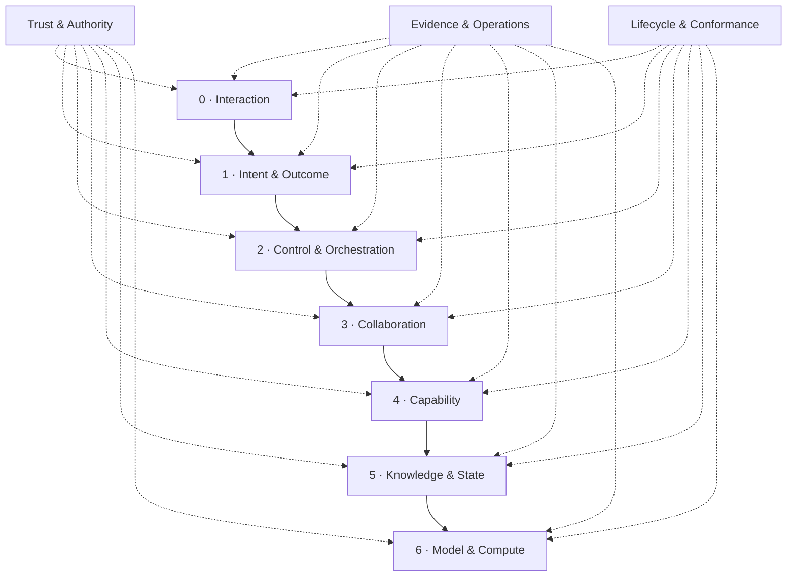

# AgenticStrata

**Make every agent action understandable, checkable, and reconstructable.**

## In plain English

- **Problem:** an AI agent can say that a task is complete while leaving people
  unable to prove what was requested, what it was allowed to do, what changed,
  or which checks passed.
- **What it does:** AgenticStrata provides vendor-neutral contracts and receipts
  that turn one agent run into a structured, verifiable record. It is the
  architectural and evidence layer around an agent application, not the agent
  framework or model itself.
- **Who it is for:** teams building enterprise agent applications that must be
  understandable to product owners, operators, auditors, and engineers.
- **Concrete example:** the included generic-change flow prepares one
  configuration change, binds it to an approval, applies it once, reads the
  result back, and records the evidence. The CLI can then explain the run in
  plain language or show exactly which required check failed.

| Feature | Real-world benefit |
| --- | --- |
| Seven responsibility layers | Teams can change models, tools, or infrastructure without mixing business intent with permissions and execution. |
| Typed intent, outcome, authority, and capability contracts | Everyone can see what success meant and which actions were actually permitted. |
| Linked run receipts and reconstruction | A reviewer can rebuild the run and detect missing or modified supplied evidence. |
| Prepare, commit, verify, and compensate lifecycle | Side effects become explicit, approval-aware, and checkable instead of hidden inside an agent loop. |
| Configurable conformance profiles | The same application can apply stricter evidence rules to enterprise, regulated, local, or distributed runs. |
| Plain-language explanation and Execution Passport | Technical run evidence can be shared with non-specialists and bound to external attestations without embedding the full payload. |
| Optional authenticated Passport verification | A relying party can require an exact trusted signer and reject a removed, altered, or substituted DSSE envelope without coupling the core to one trust provider. |

> **Maturity and limits:** this is an executable alpha reference architecture,
> not a hosted agent platform or regulatory certification. Digital fingerprints
> detect changed or missing supplied evidence but do not identify its author
> without an external signature or trusted store. The project records the meaning
> supplied to it; it cannot guarantee that an earlier normalization step
> understood the user's words correctly.

## Technical overview

AgenticStrata defines application-level runtime contracts, tamper-evident
receipts, and conformance profiles without prescribing a model, agent framework,
cloud, database, or deployment topology. It is intentionally more than a layer
diagram: a run can be validated, replayed, explained to a non-specialist, and
checked against evidence produced by the actual capability lifecycle.

## The seven strata



Logical strata may share one process. The rule is a dependency and responsibility boundary, not seven required services.

| Stratum | Owns | Must not own |
| --- | --- | --- |
| Interaction | Human, API, and event boundary | Authority issuance or model selection policy |
| Intent & Outcome | Canonical intent, constraints, acceptance criteria, safe cache fingerprint | Side effects |
| Control & Orchestration | Plans, budgets, routing, approvals, lifecycle state | Provider-specific business logic |
| Collaboration | Delegation, handoff, coordination | Authority expansion |
| Capability | Typed prepare/commit/verify/compensate operations | Hidden credentials or unbounded tools |
| Knowledge & State | Authoritative state, retrieval, artifacts, provenance | Treating retrieved text as authority |
| Model & Compute | Replaceable inference and compute providers | Authorization decisions |

## What is executable

- A JSON Schema 2020-12 contract bundle for manifests, intent, criterion results, execution, runtime boundaries, authority, delegation, capabilities, evidence, receipts, and conformance reports.
- A composite cache fingerprint that requires both semantic and operational equivalence: policy, capability set, authoritative context, tenant, privacy, constraints, and outcome are all bound.
- An RFC 8785 JSON Canonicalization Scheme implementation with cross-language golden vectors, strict duplicate-member rejection at the JSON boundary, and a hash-linked receipt chain with tamper and missing-evidence detection.
- Runtime conformance checks for rooted authority, causal evidence, actual budget consumption, exact-action idempotency, approval, read-back or compensation, predeclared criterion evidence bindings, layer direction, and model/authority separation.
- An [Execution Passport v2](docs/spec/attestations/execution-passport/v2/README.md) that binds one run bundle, its complete conformance report, one externally validated OASF record, and optional run-bound observations in a strict in-toto Statement without embedding those documents.
- Provider-neutral authenticated consumer composition plus an optional `agentic-strata/sigstore` adapter that verifies DSSE structure, exact canonical Passport bytes, cryptographic trust, and an exact issuer-plus-SAN allowlist.
- Mapping-only adapter documents for AG-UI, A2A, MCP, OpenTelemetry GenAI, CloudEvents, an external policy engine, and OASF, plus an executable StageFabric evidence-reduction adapter.
- A neutral prepare/commit/read-back demo with exact-action approval and duplicate suppression.

## Quick start

Requires Node.js 22 or newer.

```bash
npm ci
npm run check
npm run demo
```

The demo writes a `RunBundle`, `ConformanceReport`, and plain-language explanation under `.tmp/demo`.

```bash
node dist/cli.js validate examples/application.manifest.yaml
node dist/cli.js lint examples/application.manifest.yaml
node dist/cli.js conformance examples/generic-change/run.bundle.json --profile enterprise
node dist/cli.js replay examples/generic-change/run.bundle.json
node dist/cli.js explain examples/generic-change/run.bundle.json --profile enterprise
```

After producing a report, bind it to a real OASF record that has been validated by its owning ecosystem:

```bash
node dist/cli.js passport .tmp/demo/run.bundle.json \
  --report .tmp/demo/conformance-report.json \
  --oasf-record /path/to/validated-oasf-record.json \
  --oasf-media-type "$OASF_MEDIA_TYPE" \
  --output .tmp/demo/execution-passport.json
node dist/cli.js validate .tmp/demo/execution-passport.json
```

When StageFabric produces a sealed content-free placement artifact, reduce it to a run-bound descriptor before Passport creation:

```bash
node dist/cli.js bind-stagefabric /path/to/stagefabric-evidence.json \
  --uri urn:stagefabric:evidence:run-001 \
  --output .tmp/demo/stagefabric-binding.json
node dist/cli.js passport .tmp/demo/run.bundle.json \
  --report .tmp/demo/conformance-report.json \
  --oasf-record /path/to/validated-oasf-record.json \
  --oasf-media-type "$OASF_MEDIA_TYPE" \
  --execution-evidence .tmp/demo/stagefabric-binding.json \
  --output .tmp/demo/execution-passport.json
node dist/cli.js verify-passport .tmp/demo/execution-passport.json \
  --bundle .tmp/demo/run.bundle.json \
  --report .tmp/demo/conformance-report.json \
  --oasf-record /path/to/validated-oasf-record.json \
  --execution-evidence-resource /path/to/stagefabric-evidence.json
```

`passport` writes exact RFC 8785 Statement bytes suitable for an external
DSSE/Sigstore adapter. `verify-passport` is the consumer-side check: it rebuilds
the expected subject and predicate bindings from the supplied bundle, report,
and OASF record, then requires the exact bytes of every referenced execution
artifact. It proves internal consistency, not signer authenticity or OASF
semantics. Repeat `--execution-evidence` and
`--execution-evidence-resource` once per corresponding binding and artifact.

`bind-stagefabric` accepts only the exact canonical JSON plus trailing LF emitted by the StageFabric evidence writer. Pretty-printed JSON, YAML, or a reserialized object is rejected because the resulting descriptor digest identifies the retrievable file bytes, not merely an equivalent object.

### Optional authenticated verification

The root package has no runtime dependency on Sigstore. Install the optional
peers only in a relying party that needs Sigstore verification:

```bash
npm install agentic-strata sigstore@5 @sigstore/bundle@5
```

```js
import { verifyAuthenticatedExecutionPassport } from "agentic-strata";
import {
  createPublicSigstoreEnvelopeVerifier
} from "agentic-strata/sigstore";

const verifier = await createPublicSigstoreEnvelopeVerifier({
  identityPolicy: {
    allowedSigners: [{
      issuer: "https://token.actions.githubusercontent.com",
      subjectAlternativeName: "https://github.com/example/project/.github/workflows/release.yml@refs/heads/main"
    }]
  },
  thresholds: { ctLog: 1, tlog: 1 }
});

const result = await verifyAuthenticatedExecutionPassport({
  passport,
  bundle,
  report,
  oasfRecord,
  executionEvidenceResources,
  envelope: sigstoreBundle,
  verifier
});
```

The identity values are literal exact matches, never regular expressions or
wildcards. An enterprise or offline deployment can instead pass its own trusted
Sigstore `BundleVerifier` to `createSigstoreEnvelopeVerifier`. That injected
verifier owns its certificate, log, timestamp, revocation, and private-root
policy; AgenticStrata does not claim to introspect its configuration. A bare
Statement, non-DSSE bundle, second
signature, different payload type, non-canonical payload bytes, failed trust
verification, or different signer fails closed. The adapter verifies only; it
does not obtain OIDC tokens or sign Passports.

Sigstore 5 currently requires Node.js `^22.22.2 || ^24.15.0 || >=26.0.0`.
This narrower requirement applies only when importing `agentic-strata/sigstore`;
the root package remains usable on Node.js 22 or newer.

All commands accept JSON; `validate` and `lint` also accept YAML. Build once with `npm run build` before invoking the repository-local CLI. Input documents are bounded to 16 MiB, JSON member names must be unique, and YAML alias expansion is limited.

## Profiles

Profiles are configuration, not hard-coded editions:

- `core`: contracts, lineage, authority attenuation, budget usage, safe effects, evidence, and receipt integrity.
- `local-private`: core plus terminally linked runtime evidence covering the full receipt window for local data, local model hosting, and no observed network egress.
- `enterprise`: core plus high-risk approval, attestation, retention, and policy controls.
- `regulated`: enterprise plus restricted handling and longer retention.
- `distributed`: enterprise plus node attribution on every receipt.

Extend the packaged profile configuration with `--profiles`. Built-in baseline rules cannot be removed, and an unknown rule fails closed.

## Standards boundary

AgenticStrata does not redefine agent or flow manifests. External agent specifications are imported by immutable reference, digest, and media type. It also does not replace transport protocols or telemetry conventions: adapter files describe how application contracts project onto them while preserving explicit loss.

This makes it complementary to:

- [AG-UI](https://docs.ag-ui.com/introduction) at the user/agent event boundary;
- [A2A](https://a2a-protocol.org/latest/specification/) for agent-to-agent exchange;
- [MCP](https://modelcontextprotocol.io/specification/2025-11-25) for tools and context;
- [OpenTelemetry GenAI](https://github.com/open-telemetry/semantic-conventions-genai) for operational telemetry;
- [CloudEvents](https://github.com/cloudevents/spec) for event interchange;
- [in-toto Statement v1](https://github.com/in-toto/attestation/tree/main/spec/v1) for the Execution Passport envelope;
- [Open Agent Spec](https://github.com/oracle/agent-spec) and [OSSA](https://openstandardagents.org/specification/) for portable pre-runtime definitions.

Pattern and source-layout scanners can discover whether a project appears to use architectural conventions. AgenticStrata instead evaluates a declared manifest together with runtime receipts and artifacts. These are different, compatible jobs.

Read [Architecture](docs/architecture.md), [Contracts and conformance](docs/contracts-and-conformance.md), [Interoperability](docs/interoperability.md), and the [Threat model](docs/threat-model.md).

## Product boundaries

- Hash linking detects mutation and gaps; it is not a digital signature or non-repudiation mechanism. Sign receipts or store them in an append-only trusted system when that property is required.
- Conformance proves the checks implemented for the selected profile over the supplied evidence. It is not regulatory certification.
- Prepared actions, observed results, and compensation results use distinct attested evidence roles. Each evidence-required acceptance criterion predeclares the exact capability, action digest, and role it accepts; reusing pre-effect or unrelated evidence fails conformance.
- Run status and conformance status are separate: a failed run can still have an intact, conformant evidence record, but it is never explained as a completed outcome.
- Reports bind the evaluator name, package version, semantic revision, selected rule set, and effective profile configuration. The evaluator digest identifies the declared implementation revision; it is not a code signature.
- An unsigned Execution Passport proves deterministic integrity and cross-artifact binding only. Authenticity requires an externally verified DSSE envelope or equivalent trusted channel, and consumers must make that requirement explicit so removing a signature cannot silently downgrade policy.
- `verifyAuthenticatedExecutionPassport` composes complete artifact-set verification with one injected envelope verifier. The optional Sigstore subpath enforces DSSE-only input, one signature, exact canonical payload bytes, and literal issuer-plus-SAN authorization. Its public-TUF factory also wires positive CT/Rekor thresholds; an injected enterprise verifier owns and must enforce its own trust thresholds, root lifecycle, and revocation policy.
- Consumer verification requires the complete supplied subject set and exact bytes for every execution-evidence resource; validating the Passport schema alone does not verify those bindings.
- The OASF subject digest proves which opaque record was bound; it does not prove that the record is semantically valid OASF. Validate it before passport creation with the specification owner’s tooling.
- Execution-placement evidence enters the predicate only as a strict, run-bound, observation-only descriptor with a normalized observation time and no payload or `content` field. A StageFabric descriptor hashes the exact canonical JSON file bytes, including its trailing LF. Descriptor metadata must come from a trusted producer and be redacted or pseudonymized when sensitive; its optional stable URI may be omitted. Full provider result objects are outside the Passport contract.
- The StageFabric adapter follows its finalized `0.7.0-alpha.1` successful-run contract: trace events are either completed placements or pre-output retries with status `429`, `502`, `503`, or `504`. Terminal failures, arbitrary HTTP codes, missing retry codes, and codes attached to completed events fail closed.
- A safe fingerprint binds the declared canonical intent. It does not prove that an upstream intent normalizer chose the correct meaning.
- Adapter documents are integration contracts, not bundled protocol SDKs or policy engines.
- The current release is an alpha contract surface. Version consumers explicitly before production adoption.

## Development

```bash
npm run release:check
```

The release gate runs strict lint and types, 100+ tests with coverage thresholds, build, repository hygiene, production audit, `publint`, and Are the Types Wrong.

Apache-2.0 licensed. See [CONTRIBUTING.md](CONTRIBUTING.md) and [SECURITY.md](SECURITY.md).
