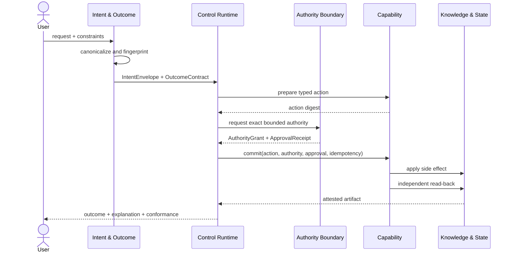

# Architecture

## Design rule

The model proposes; the runtime enforces. Every operation crosses a typed boundary owned outside model inference. State, policy, authority, and evidence therefore remain inspectable when models or orchestration frameworks are replaced.

## Dependency direction

Strata are ordered from user-facing concerns to replaceable compute. A stratum may depend only on a higher ordinal, never back toward interaction. Cross-cutting planes may observe or constrain all strata but do not become hidden business layers.

```text
interaction -> intent-outcome -> control-orchestration -> collaboration
            -> capability -> knowledge-state -> model-compute
```

The `lint` command validates the complete set, canonical ordinal, unique declaration, known dependencies, and direction. A modular monolith is a first-class deployment: the contracts create replaceable seams without forcing a network hop.

## Cross-cutting planes

### Trust & Authority

- Identity, policy, and human decisions issue grants.
- A model is never an issuer.
- Delegation can only reduce scope, resources, validity, and budget.
- Every grant lineage is acyclic and reaches a human or identity-provider trust root; service policy grants must be attenuated children.
- High-risk commits bind the actor, resource, capability, prepared action digest, authority grant, and approval receipt.
- Retrieved or user-supplied untrusted text remains data even when it influences a proposal.

### Evidence & Operations

- Operational facts are hash-linked as receipts.
- Decisions, attestations, criterion results, boundary observations, and receipts form one backward-only causal DAG; future and cyclic evidence is rejected.
- Runtime payloads are externalized as artifacts and bound by attestations.
- Decisions expose concise summaries, selected and rejected options, and evidence references; private model reasoning is not a contract.
- Distributed mode requires node attribution on every receipt.
- An Execution Passport projects completed, failed, or incomplete run state into a strict in-toto Statement while keeping the run bundle, report, OASF record, and provider evidence out of the Statement body.

### Lifecycle & Conformance

- Profiles select composable rules from YAML configuration.
- Built-in rules are a non-removable baseline; custom profile configuration is additive and its digest is recorded in every report.
- Side effects use prepare, commit, verify, and—at higher risk—compensate.
- Evidence-required acceptance criteria bind the planned capability, canonical action digest, and acceptable result role before execution; runtime evidence must match that immutable requirement.
- Idempotency is enforced at the capability boundary.
- The observed budget record is checked against the execution envelope rather than inferred from configuration alone.
- Requested outcomes, per-criterion results, run status, and conformance status remain distinct.

## Runtime sequence



## Execution Passport boundary

Passport creation is a deterministic packaging step after conformance evaluation, not another conformance rule. The builder verifies the bundle and report schemas, report and evaluator seals, the ordered unique check-to-rule binding and derived status, exact bundle and manifest bindings, receipt-chain integrity, run identity, terminal state, report-after-evidence chronology, and issuance ordering. It then emits exactly three ordered subjects:

1. the canonical `RunBundle` digest;
2. the canonical digest of the complete `ConformanceReport`, including its own `digest` field;
3. the canonical digest of one opaque, externally validated OASF record.

Optional execution-placement evidence is reduced to a `ResourceDescriptor` with no payload or `content` field. AgenticStrata admits only the descriptor, producer identity, fixed role, canonical run-identifier digest, normalized observation time, `observation-only` authority, and `content-free` disclosure marker. A StageFabric adapter validates the source artifact, its successful-run-only trace (`completed` or a pre-output retry with `429`, `502`, `503`, or `504`), timestamp grammar, producer seal, and exact canonical-JSON-plus-LF writer bytes before reduction. Descriptor metadata must be trusted and redacted or pseudonymized when sensitive, and its URI may be omitted. A placement observation never grants authority; a descriptor from another run or after the report is rejected.

The consumer path accepts the Passport together with all three subject documents
and the exact bytes of every execution-evidence resource. It reconstructs the
expected Statement, checks the complete bundle/report relationship again, and
requires a one-to-one digest match for external evidence. Schema validation by
itself is deliberately insufficient.

The core emits an unsigned Statement. `verifyAuthenticatedExecutionPassport`
first verifies the complete artifact set, then delegates the envelope to an
injected provider-neutral verifier over the exact RFC 8785 Statement bytes. It
never falls back to unsigned acceptance. The optional `agentic-strata/sigstore`
subpath admits only one-signature DSSE bundles with payload type
`application/vnd.in-toto+json`, exact payload bytes, and an exact issuer-plus-SAN
allowlist. The public Sigstore TUF factory additionally wires positive CT/Rekor
thresholds. Enterprise and offline trust stores inject their own compatible,
trusted verifier and own its certificate, log, timestamp, and revocation policy.
Signing, key custody, trust-root lifecycle, and stronger trusted-time policy
remain outside the core.

## Safe semantic caching

Two utterances may normalize to the same canonical intent, but a cached answer is admitted only when operational context is also equivalent. The cache key binds:

1. contract version;
2. canonical intent;
3. constraints;
4. authoritative context digests;
5. outcome digest;
6. policy bundle digest;
7. capability-set digest;
8. tenant partition;
9. privacy partition.

Untrusted context is deliberately excluded from authority, but this does not make it harmless. Applications may include a separate content digest in constraints when untrusted content materially affects the result.

## Deployment profiles

The same contracts support a single process, a modular monolith, or distributed services. Deployment changes transport and failure modes, not ownership. A `local-private` assessment requires a sealed runtime observation linked from the receipt chain; changing manifest labels alone cannot satisfy it. An enterprise profile can use managed compute behind the same `Model & Compute` boundary.
